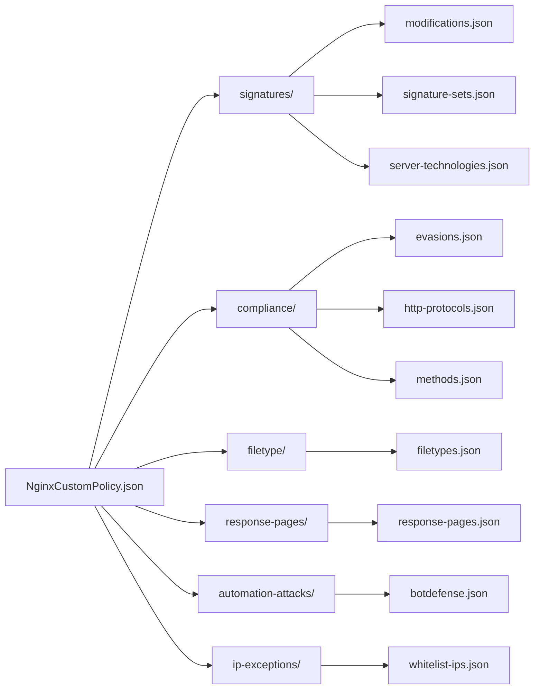

# NginxCustomPolicy.json

Main App Protect policy file. 

+ [App protect documentation](https://docs.nginx.com/nginx-app-protect/configuration/)

References files in sub-folders for the configuration of each violation.

## Blocking settings

[Documentation](https://docs.nginx.com/nginx-app-protect/configuration/#basic-configuration-and-the-default-policy)

Defines logging and enforcement (blocking).

The default policy enforces violations by Violation Rating, the App Protect computed assessment of the risk of the request based on the triggered violations.

    0: No violation
    1-2: False positive (no block)
    3: Needs examination (only if VIOL_RATING_NEED_EXAMINATION is enabled - default disabled)
    4-5: Threat (only if VIOL_RATING_THREAT is enabled - default enabled )

The default policy enables most of the violations with Alarm turned on, but not Block. By default, if the violation rating is 4-5 the request is blocked using the VIOL_RATING_THREAT violation. By default, other requests which have a lower violation rating are not blocked, except for some specific violations described below. This is to minimize false positives. However, you can change the default behavior. For example, if you want to add blocking on a violation rating of 3 as well, enable blocking for the VIOL_RATING_NEED_EXAMINATION violation.

The following violations have a low chance of being false positives and are, therefore, configured by default to block the request regardless of its Violation Rating:

    High accuracy attack signatures
    Threat campaigns
    Malformed request: unparsable header, malformed cookie and malformed body (JSON or XML).

### Enabling Violations
Adding and enabling additional security features to the policy can be done by specifying the violation name and the alarm block state to “true”. To set different states to sub-violations within the violation, enable the violation first, then specifying and enable the sub-violations. Also, a violation may have its own section that provides additional configuration granularity for a specific violation/sub-violation. 

## Dataguard

[Documentation](https://docs.nginx.com/nginx-app-protect/configuration/#data-guard-blocking)

## Allowed Response codes (for 4xx,and 5xx)

[Documentation](https://docs.nginx.com/nginx-app-protect/configuration/#response-codes)

## XFF headers

[Documentation](https://docs.nginx.com/nginx-app-protect/configuration/#xff-headers-and-trust)

